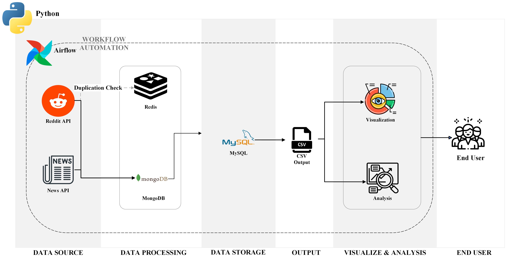

# Reddit Post Sentiment Analysis Data Pipeline


## Project Overview
### Objective
This project aims to investigate the impact of news sentiment on the sentiment of Reddit posts, specifically focusing on topics relevant to ChatGPT. Through sophisticated sentiment analysis, we explore the correlation between the tone of news headlines and the emotional responses evident in Reddit discussions

## Table of Contents

- [Project Overview](#project-overview)
- [Table of Contents](#table-of-contents)
- [Architecture](#architecture)
- [Environment Setup](#installation-and-setup)
- [Improvements](#improvements)


## Architecture

### Workflow Automation with Airflow
#### Step 1: Load Data
- **Reddit Data**: Utilize `PRAW` (Python Reddit API Wrapper) to collect daily Reddit post data.
  - Check for post uniqueness using `Redis`.
  - Store posts for analysis in `MongoDB`.
- **News Data**: Use `Requests` library to fetch data from `Newsapi.org`.
  - Store news headlines in `MongoDB`.

#### Step 2: Data Storage & Processing
- Use the `TextBlob` library to compute polarity and subjectivity for post titles and news titles.
- Organize the computed data into a `MySQL` database.

#### Step 3: Output
- Export data from the MySQL database as a CSV file into the project folder.

#### Step 4: Visualization and Analysis
- **Visualization**: Generate various charts and graphs using `Seaborn` and `Matplotlib`:
  - `Joint Plot`: Analyze the relationship between post subjectivity and polarity.
  - `Point Plot`: Correlate news polarity with post polarity.
  - `Box Plot`: Visualize the distribution of title length.
  - `Count Plot`: Display distribution across sentiment classes.
  - `Pie Chart`: Show the percentage of each sentiment class.
- **Analysis**: Train a model to predict sentiment classes ranging from very positive to very negative.

### End-User Impact

The project provides end-users with insightful visualizations and analyses to understand public sentiment trends better using data collected and processed through an automated pipeline.

### Technologies Used
- `Python`
- `Airflow`
- `PRAW`
- `Redis`
- `MongoDB`
- `MySQL`
- `TextBlob`
- `CSV`
- `Seaborn` and `Matplotlib` for data visualization


### Project Folder Tree
```
├── dags
│   ├── redditpost_etl_dag.py
│   └── testdag.py
├── image
│   ├── Subjectivity_vs_Polarity_joint_plot.png
│   ├── cover.jpg
│   ├── news_polarity_vs_post_polarity_point_plot.png
│   ├── sentiment_class_countplot.png
│   ├── sentiment_class_pie_chart.png
│   └── title_length_boxplot.png
├── md_file
│   ├── charts.md
│   └── dev_log.md
├── output
│   ├── news_output.csv
│   └── posts_output.csv
├── readme.md
├── .gitignore
├── scripts
│   ├── SQL
│   │   ├── backfill_sql_db.py
│   │   ├── create_table.sql
│   │   ├── interact_with_sql_db_query.py
│   │   └── mysql_table.md
│   ├── __init__.py
│   ├── data_visualization.py
│   ├── get_reddit_thread.py
│   ├── news
│   │   ├── __init__.py
│   │   └── backfill_news.py
│   └── post_sentiment_processing.py
├── secrets.ini
└── utilis
    ├── __init__.py
    ├── load_mysql_data.py
    ├── mongodb_helper.py
    ├── mysql_helper.py
    ├── news_helper.py
    ├── reddit_helper.py
    ├── redis_helper.py
    ├── settings.py
    ├── subredditTopics.txt
    └── visualization_helper.py
 ```


## Installation and Setup

### System Requirements

#### Local system configuration:

**Computer specs:**
- **Chip:** Apple M2
- **RAM:** 16 GB
- **macOS:** 14.1

**IDEs and Tools:**

| Software        | Name            | Version |
|-----------------|-----------------|---------|
| IDE             | Visual Studio Code | v1.84.1  |
| Database Management | RedisInsight | v2.36.0 |
| Database Management | DBeaver       | v23.2.4  |

**Virtual Environment**
To set up the pipeline locally, first, you will have to set up a virtual environment, in my example it's named `reddit_venv` under the same directory where the project folder is located.
**Python Version:** v3.10.10
**Python Packages:**

| Package         | Version |
|-----------------|---------|
| Redis server    | v7.2.3  |
| PyMongo 		  | v3.11.0 |
| Airflow         | v2.3.1  |
| MySQL           | v14.14  |
| TestBlob		  |v0.17.1  |


 
 **Crediential File**
You will then have to add a credentials file for accessing reddit API, MongoDB connection, and MySQL connection.  Then populate the `secrets.ini` file with the following template:
```
[reddit_cred]
username=<reddit username>
password=<reddit password>
user_agent=<dev_application_name>
client_id=<dev_application_client_id>
client_secret=<dev_application_client_secret>
[mongodb_cred]
user_id = <your mongodb user id>
password = <your mongodb password>
[mysql_cred]
host = localhost
user = root
password = <your mysql password>
```
Source|What to do
--|--
Reddit API|Create a reddit developer application at https://www.reddit.com/prefs/apps/ to get the above information.
MongoDB| Create a MongoDB account at [MongoDB](https://www.mongodb.com/cloud/atlas/lp/try4?utm_source=google&utm_campaign=search_gs_pl_evergreen_atlas_core_retarget-brand_gic-null_amers-us-ca_ps-all_desktop_eng_lead&utm_term=mongodb&utm_medium=cpc_paid_search&utm_ad=e&utm_ad_campaign_id=14291004479&adgroup=128837427347&cq_cmp=14291004479&gad_source=1&gclid=CjwKCAiA04arBhAkEiwAuNOsIrm8Kz1SvZaEEUQrQQynJbCXMT9B7DmUVHIU26poPtOvjpMAnK96jBoCMXwQAvD_BwE) 
MySQL | password set at installation


## Improvements
`Development Log`: [Development Log](./md_file/dev_log.md)
