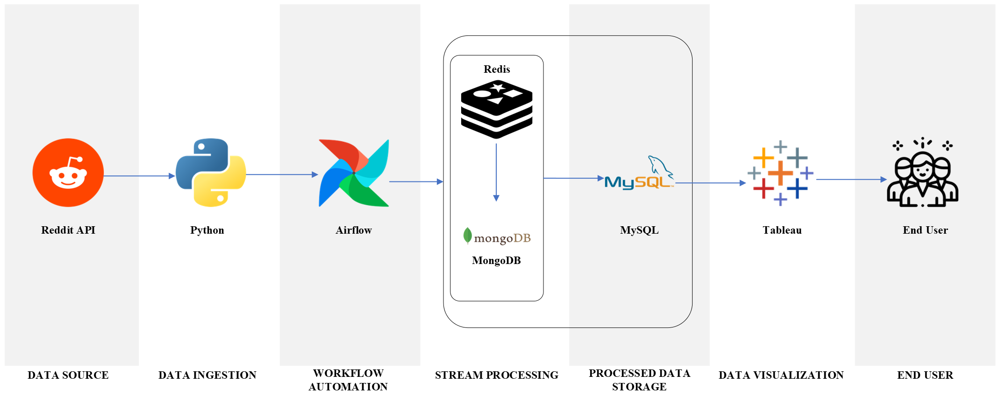
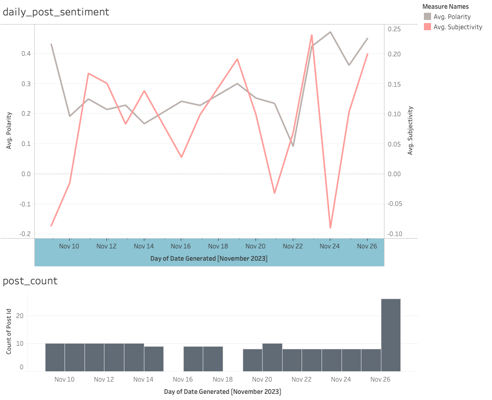

# Reddit Post Sentiment Analysis Data Pipeline

<div align="center">
  <br>
</div>

## Project Overview
### Objective
To build a data pipeline that gathers and analyzes Reddit post data based on user-defined interests.
   

## Table of Contents

- [Project Overview](#project-overview)
- [Table of Contents](#table-of-contents)
- [Architecture](#architecture)
- [Installation and Setup](#installation-and-setup)
- [Improvements](#improvements)
- [Acknowledgements](#acknowledgements)


## Architecture



### Process Flow

- **Data Source**: Utilizes the Reddit API, interfaced with the Python `praw` library.
- **User Input**: Interests specified in `subredditTopics.txt` to guide data collection.
- **Duplication Check**: Unique post IDs checked against Redis database for uniqueness.
- **Data Ingestion**: Retrieves a set number of posts per subreddit topic, containing titles and bodies, configured in `settings.txt`.
- **Sentiment Analysis**: Conducted in a MySQL database.
- **Automation**: Managed by two AirFlow schedulers for stream processing and data storage, typically executed near day's end.
- **Data Visualization**: Tableau visualizes sentiment analysis results from MySQL database.
- **End Result**: Users interact with a dashboard displaying sentiment trends across Reddit topics.
   

    


## Installation and Setup

### System Requirements

#### Local system configuration:

**Computer specs:**
- **Chip:** Apple M2
- **RAM:** 16 GB
- **macOS:** 14.1

**IDEs and Tools:**

| Software        | Name            | Version |
|-----------------|-----------------|---------|
| IDE             | Visual Studio Code | v1.84.1  |
| Database Management | RedisInsight | v2.36.0 |
| Database Management | DBeaver       | v23.2.4  |

**Virtual Environment**
To set up the pipeline locally, first, you will have to set up a virtual environment, in my example it's named `reddit_venv` under the same directory where the project folder is located.
**Python Version:** v3.10.10
**Python Packages:**

| Package         | Version |
|-----------------|---------|
| Redis server    | v7.2.3  |
| PyMongo 		  | v3.11.0 |
| Airflow         | v2.3.1  |
| MySQL           | v14.14  |
| TestBlob		  |v0.17.1  |

* After installing testblob, remember to download necessary corpora used by TextBlob with code below

```
from textblob import download_corpora 
download_corpora.download_all()
```
 
 **Crediential File**
You will then have to add a credentials file for accessing reddit API, MongoDB connection, and MySQL connection.  Then populate the `secrets.ini` file with the following template:
```
[reddit_cred]
username=<reddit username>
password=<reddit password>
user_agent=<dev_application_name>
client_id=<dev_application_client_id>
client_secret=<dev_application_client_secret>
[mongodb_cred]
user_id = <your mongodb user id>
password = <your mongodb password>
[mysql_cred]
host = localhost
user = root
password = <your mysql password>
```
Source|What to do
--|--
Reddit API|Create a reddit developer application at https://www.reddit.com/prefs/apps/ to get the above information.
MongoDB| Create a MongoDB account at [MongoDB](https://www.mongodb.com/cloud/atlas/lp/try4?utm_source=google&utm_campaign=search_gs_pl_evergreen_atlas_core_retarget-brand_gic-null_amers-us-ca_ps-all_desktop_eng_lead&utm_term=mongodb&utm_medium=cpc_paid_search&utm_ad=e&utm_ad_campaign_id=14291004479&adgroup=128837427347&cq_cmp=14291004479&gad_source=1&gclid=CjwKCAiA04arBhAkEiwAuNOsIrm8Kz1SvZaEEUQrQQynJbCXMT9B7DmUVHIU26poPtOvjpMAnK96jBoCMXwQAvD_BwE) 
MySQL | password set at installation